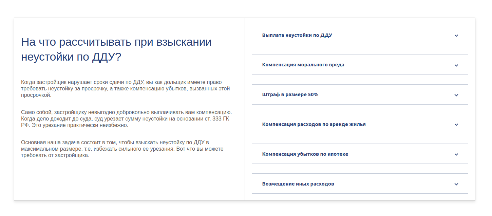
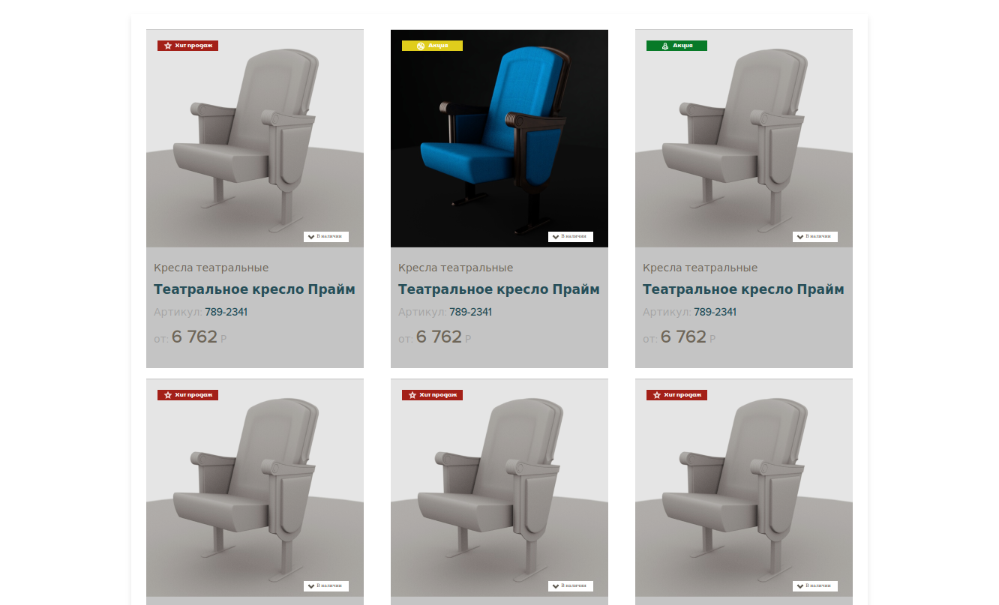
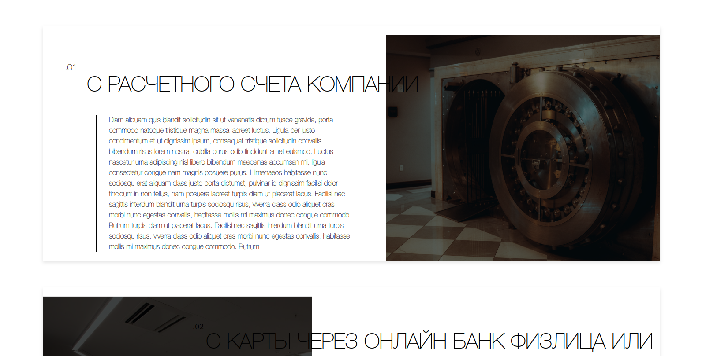
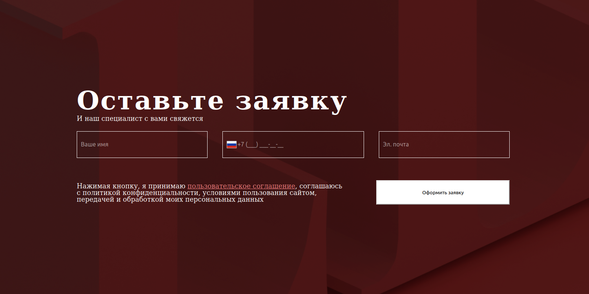
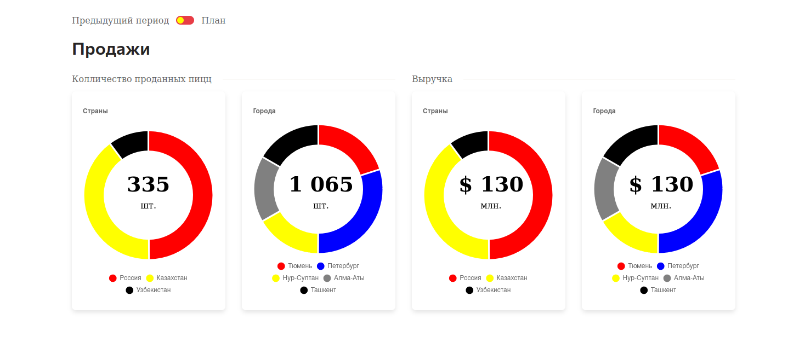

# Тестовое задание компании 2dit

*Проект включает в себя 5 выполненных тестовых заданий. Задания разделены по папкам.*

## Скриншоты

|                   |                                       | 
| ------------------|:-------------------------------------:| 
| Превое задание    |          | 
| Второе задание    |          |  
| Третье задание    |          |    
| Четвертое задание |          |  
| Пятое задание     |          |  

## Запуск проекта
**В проекте используется node.js + express для простого веб-сервера**
**Запуск npm start**

## Тз
[Макет](https://www.figma.com/file/5HlZbJsMgTzBUVyxpsfw3d/2Dit-Front-End-Test?type=design&node-id=488%3A7&mode=design&t=J4JQcJf1NkjXtyLa-1)